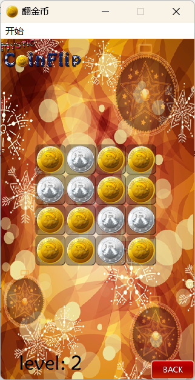

## 翻金币游戏

## 1. 需求

- 开始场景

  ​    开始按钮：点击之后进入第二个场景	自定义按钮实现，页面切换

- 关卡选择场景

  ​    20个按钮：点击后都会进入第三个场景，第三个场景的硬币盘面不同，自定义按钮实现

- 游戏场景

  ​    4*4的宫格，放置16个硬币，点击一个硬币翻转，同时翻转上下左右4个硬币，把金币变成硬币，银币变成金币

  硬币 自定义按钮实现，点击翻转动画

  ​    胜利条件：全部都是金币的时候游戏胜利，同时播放动画和音效

窗口标题、icon

窗口大小固定

菜单栏-退出

## 2. 项目基础搭建

创建项目CoinFlip，基类是QMainWindow，类名设置为MyMainWindow  作为其他子窗口的基类

导入资源文件

在ui文件中创建菜单项--开始--退出

```c++
//设置退出功能
void MyMainWindow::on_actionQuit_triggered()
{
    close();
}
```

设置基础模板：公有参数，子类窗口就不需要再设置这些参数

```c++
    //窗口标题
    this->setWindowTitle("翻金币");
    //设置窗口的icon
    this->setWindowIcon(QIcon(":/res/Coin0001.png"));
    //设置窗口的固定大小
    this->setFixedSize(320,588);
```


## 3.开始场景

### 3.1 创建文件，基础界面

新建C++类  ，StartScene  继承于MyMainWindow

```c++
//startscene.h
#include<mymainwindow.h>
class StartScene : public MyMainWindow
```

```c++
//startscene.cpp
StartScene::StartScene(QWidget *parent)
    : MyMainWindow{parent}
{
    this->setWindowTitle("开始场景");
}
```

### 3.2添加背景

使用重写paintEvent事件去绘制背景

```c++
//mymainwindow.h
protected:
    void paintEvent(QPaintEvent *event);
```

```c++
 //mymainwindow.cpp
#include<QPainter>

void MyMainWindow::paintEvent(QPaintEvent *event)
{
    //绘制背景图片
    QPainter painter(this);
    QPixmap pix(":/res/MenuSceneBg.png");
    painter.drawPixmap(0,0,this->width(),this->height(),pix);
}
```


### 3.3  开始按钮及动画

#### 3.3.1 创建按钮

```c++
//startscene.cpp
#include<QPushButton>

StartScene::StartScene(QWidget *parent): MyMainWindow{parent}
{  
    //创建Start按钮
    QPushButton *btnStart =new QPushButton(this);
    btnStart->resize(114,114);
    //按钮水平居中，垂直方向在3/4位置
    //即x= 窗口宽度/2 -按钮宽度/2 , y=窗口高度*3/4 -按钮高度/2
    btnStart->move((this->width()-btnStart->width())/2,
                   this->height()*3/4-btnStart->height()/2);		//设置好高度然后自定义一个按钮
}
```

创建C++类 MyPushButton 继承于QPushButton

然后将startscene.cpp中的new一个btnStart的操作修改

```c++
#include"mypushbutton.h"
{
	//QPushButton *btnStart =new QPushButton(this);
    //修改为
    MyPushButton *btnStart =new MyPushButton(this);
}
```

然后重写绘图事件，自定义按钮

```c++
//mypushbutton.h
//重写绘图事件
protected:
    void paintEvent(QPaintEvent *ev);
```

```c++
//mypushbutton.cpp
#include<QPainter>

void MyPushButton::paintEvent(QPaintEvent *ev)
{
    //绘制按钮的图片
    QPainter painter(this);     //以当前窗口为画布 这个pushbutton
    QPixmap pix;
    pix.load(":/res/MenuSceneStartButton.png");
    painter.drawPixmap(0,0,this->width(),this->height(),pix);
}
```


#### 3.3.2 实现按钮的动画

用到一个QPropertyAnimation，属性动画对象，设置要做动画的对象和属性

属性动画就会根据时间生成目标对象某个属性过渡的动画

这里对象就是按钮this,属性是geometry（包括x,y坐标和宽w高h的一个属性）

```c++
//mypushbutton.h
public:
    //创建按钮往下网上的动画函数
    void moveDown();
    void moveUp();
```

```c++
//mypushbutton.cpp
#include<QPropertyAnimation>

void MyPushButton::moveDown()
{
    //1位置大小属性发生变化
    QPropertyAnimation *animation =new QPropertyAnimation(this,"geometry",this);        //(做动画的对象this该按钮,位置大小属性,对象树父对象)
    //2给定开始的位置大小属性
    animation->setStartValue(this->geometry());
    //3给定结束的位置大小属性
    animation->setEndValue(QRect(this->x(),this->y()+10,this->width(),this->height()));     //在y轴上向下移动10像素
    //4给定速度，给定动画时长
    animation->setDuration(100);        //速度不好给，所以给定时间100ms
    animation->start(QAbstractAnimation::DeleteWhenStopped);        //执行之后，delete掉animation
}

void MyPushButton::moveUp()
{
    QPropertyAnimation *animation =new QPropertyAnimation(this,"geometry",this);
    animation->setStartValue(this->geometry());
    animation->setEndValue(QRect(this->x(),this->y()-10,this->width(),this->height()));     //在y轴上向上移动10像素
    animation->setDuration(100);
    animation->start(QAbstractAnimation::DeleteWhenStopped);        //start之后不是阻塞的，所以会直接执行moveUp进而覆盖掉了moveDown
}
```

```c++
//startscene.cpp
#include<QTimer>

//在构造函数中继续添加:
connect(btnStart,&MyPushButton::clicked,[=](){
        //按下按钮之后，设置按钮为不可用，---因为避免当按键速度过快，会影响动画播放，即前两个动画还没播放完就点击了按钮，又重新播放，可以把按钮固定在原处
        btnStart->setEnabled(false);

        //播放向下动画
        btnStart->moveDown();
        //往上走的动画，会覆盖向下的动画
        //所以需要等待之前动画播放完 在继续调用
        QTimer::singleShot(150,[=](){           //单发的定时器函数，不需要声明，singleShot只执行一次（时间，槽）
            btnStart->moveUp();
        });

        QTimer::singleShot(350,[=](){
            //将按钮重新设置为可用
            btnStart->setEnabled(true);
        });
```


## 4. 场景切换   开始--关卡选择

### 4.1 创建关卡选择类

创建C++类  SelectScene 继承于MyMainWindow

因为切换场景时，存在内存释放问题，所以直接再startscene.h中声明成员变量

```c++
//startscene.h
#include"selectscene.h"

private:
    SelectScene mSelectScene;
```


### 4.2 从开始场景切换到关卡选择场景

这时从开始场景切换到关卡选择场景，就有一个成员变量

```c++
//startscene.cpp
	...
	btnStart->setEnabled(true);		//下面接着写:

	//-------场景切换
	//隐藏当前窗口
	this->hide();
	//显示第二个窗口
	this->mSelectScene.show();      //因为存在内存释放问题，所以切换第二个场景时，在第一个场景中声明这个成员变量
```


### 4.3 从关卡选择场景切换到开始场景

#### 4.3.1 场景back按钮

```c++
//selectscene.cpp
#include<QPushButton>
	//构造函数中:
    QPushButton *btnBack =new QPushButton("Back",this);
    connect(btnBack,&QPushButton::clicked,this,&SelectScene::backBtnClicked);       //信号连接信号，按钮按下时触发自定义信号
```

#### 4.3.2 实现 关卡--开始的切换

```c++
//selectscene.h
signals:
    void backBtnClicked();      //自定义信号，触发场景切换
```

```c++
//startscene.cpp    
//构造函数中:
    connect(&this->mSelectScene,&SelectScene::backBtnClicked,[=](){
        //当第二个窗口的返回按钮被点击时，自定义信号传过来
        this->show();               //开始场景显示
        this->mSelectScene.hide();  //关卡选择场景隐藏
    });
```


## 5. 关卡选择场景

在场景切换中，已经实现了关卡选择场景的基本创建，类、back按钮的创建

### 5.1 重绘back按钮

back按钮有背景图片，且按下的时候有一个下压的动画，即两个图片切换动画，并且能够返回开始场景

#### 5.1.1 设置按钮的位置及大小

```c++
//selectscene.cpp
//构造函数:
//------back按钮
    btnBack->resize(72,32);

    btnBack->move(this->width()-btnBack->width(),this->height()-btnBack->height());
```

#### 5.1.2 重绘按钮

因为start按钮和back按钮都是自定义按钮，所以让这两个按钮都继承于MyPushButton,然后通过传参的方式，将按钮的两个状态的图片传入，这样就优化了代码，使MyPushButton复用度更高

先修改一下mypushbutton的相关代码

```c++
//mypushbutton.h		修改这个自定义按钮的构造函数，使其可以重复使用在别的自定义按钮上
public:
    explicit MyPushButton(QWidget *parent = nullptr);      
    //创建按钮往下网上的动画函数
    void moveDown();
    void moveUp();
protected:
    void paintEvent(QPaintEvent *ev);
signals:

//mypushbutton.cpp
MyPushButton::MyPushButton(QWidget *parent)
    : QPushButton{parent}
{

}
void MyPushButton::paintEvent(QPaintEvent *ev)
{
    //绘制按钮的图片
	...
    pix.load(":/res/MenuSceneStartButton.png");
	...
}


/*------------------------------------------------修改如下------------------------------------------------*/

//mypushbutton.h
public:
    //因为开始按钮和start按钮都是按钮重绘，所以把MyPushButton进行复用
    MyPushButton(QString normalImg,QString pressedImg,QWidget *parent = nullptr);      //通过QString的方式将资源名传进来

    //创建按钮往下网上的动画函数
    void moveDown();
    void moveUp();

protected:
    void paintEvent(QPaintEvent *ev);

signals:
    
private:
    //正常状态的图片和鼠标按下的图片
    QString mNormalImg;
    QString mPressedImg;

//mypushbutton.cpp
MyPushButton::MyPushButton(QString normalImg,QString pressedImg,QWidget *parent)
    : QPushButton{parent}
    ,mNormalImg(normalImg)
    ,mPressedImg(pressedImg)
{

}

void MyPushButton::paintEvent(QPaintEvent *ev)
{
    //绘制按钮的图片
	...
    pix.load(mNormalImg);
	...
}

//startscene.cpp
//------创建Start按钮   在this前面添加start按钮的两个图片
MyPushButton *btnStart =new MyPushButton(":/res/MenuSceneStartButton.png",":/res/MenuSceneStartButton.png",this);
```

对back按钮进行修改重绘

```c++
//selectscene.cpp
//构造函数中:
//------开关-关卡选择切换
    QPushButton *btnBack =new QPushButton("back",this);

/*------------------------------------------------修改如下------------------------------------------------*/

    MyPushButton *btnBack =new MyPushButton(":/res/BackButton.png",":/res/BackButtonSelected.png",this);
```


#### 5.1.3 图片切换

类比于实例2的按钮切换

先对其状态进行声明

```c++
//mypushbutton.h
public:
    enum MyPushButtonStat       //表示对应状态
    {
        Normal,
        Pressed
    };
private:
    //记录按钮状态
    MyPushButtonStat mStat;
```

```c++
//mypushbutton.h   
//构造函数:
   mStat=Normal;       //初始状态

void MyPushButton::paintEvent(QPaintEvent *ev)
{
    //绘制按钮的图片
	...
    //pix.load(mNormalImg);修改成下面这样，进行一个判断切换图片	切换的条件就是状态变化，而状态变化的条件是鼠标按下松开
    if(mStat == Normal)
    {
        pix.load(mNormalImg);
    }
    if(mStat == Pressed)
    {
        pix.load(mPressedImg);
    }
    ...
}

```

所以接下来对鼠标事件进行重写

```c++
//mypushbutton.h
protected:
    //-------图片切换，状态切换的触发条件，鼠标的按下松开
    void mousePressEvent(QMouseEvent *e);
    void mouseReleaseEvent(QMouseEvent  *e);
```

```c++
//mypushbutton.cpp
void MyPushButton::mousePressEvent(QMouseEvent *e)
{
    //鼠标按下时，状态切换到Pressed
    this->mStat = Pressed;
    update();
    QPushButton::mousePressEvent(e);    //保证信号和槽能实现，保证信号能够发出，信号依赖于事件发生
}

void MyPushButton::mouseReleaseEvent(QMouseEvent *e)
{
    //鼠标按下时，状态切换到Normal
    this->mStat = Normal;
    update();
    QPushButton::mouseReleaseEvent(e); 
}
```


### 5.2 更新背景图片及logo

```c++
//selectscene.h
//重绘paintEvent事件
protected:
    void paintEvent(QPaintEvent *event);
```

```c++
//selectscene.cpp
void SelectScene::paintEvent(QPaintEvent *event)
{
    //绘制背景图片
    QPainter painter(this);
    //搬动画家
    painter.translate(0,this->menuBar()->height());     //搬动画家到菜单项下面，不然背景会被遮住一部分
    //画背景图
    QPixmap pix(":/res/OtherSceneBg.png");
    painter.drawPixmap(0,0,this->width(),this->height(),pix);
    //添加第二张照片，绘制logo
    pix.load(":/res/Title.png");
    painter.drawPixmap(0,0,pix);
}
```


### 5.3 关卡选择按钮*20

#### 5.3.1按钮创建，位置调整

```c++
//selectscene.cpp
//构造函数中:
//------20个关卡按钮
    const int colWidth  =70;    //列宽
    const int rowHeight =70;    //行高
    //x y偏移     原点偏移，不然按钮会怼到开始菜单那里
    const int x0ffset =25;
    const int y0ffset =130;

    for(int i = 0; i<20; ++i)
    {
        QPushButton *btn =new QPushButton(QString::number(i+1),this);
        //排列
        int row = i / 4;            //行 i / 4
        int col = i % 4;            //列 i % 4
        int x = col *colWidth + x0ffset;      //x坐标 = 列数 * 列宽 +x偏移
        int y = row *rowHeight +y0ffset;      //y坐标 = 行数 * 行高 +y偏移
        btn->resize(57,57);         //按钮大小
        btn->move(x,y);
    }
```


#### 5.3.2 按钮重绘

进行用MyPushButton父类的图片重绘

```c++
//selectscene.cpp
//构造函数中 的for循环中 修改一下按钮定义为:
	MyPushButton *btn =new MyPushButton(":/res/LevelIcon.png",":/res/LevelIcon.png",this);      //同样分为两个图片Normal和Pressed
	btn->setText(QString::number(i+1));
```

之前在创建MyPushButton基类时，没有设置文字 所以这时候只有按钮，没有文字

```c++
//mypushbutton.cpp
void MyPushButton::paintEvent(QPaintEvent *ev)
{
	...
    //---绘制按钮的文字
    painter.drawText(0,0,this->width(),this->height(),Qt::AlignHCenter | Qt::AlignVCenter,this->text());	//把按钮的自身的文字重写一遍	
}

```


## 6. 场景切换  关卡选择--游戏场景

### 6.1 创建游戏场景

创建新的C++类，命名PlyaScene,继承于MyMainWindow

### 6.2 实现关卡--游戏

```c++
//selectscene.cpp
//构造函数中的for函数下:		进行批量处理
//------场景切换    关卡选择--游戏
//这里因为每次选择的关卡不同，进入的数据不同，所以不使用之前那种成员变量的方式去切换场景，这里直接使用new的方式去创建
	connect(btn,&MyPushButton::clicked,[=](){
	//点击关卡按钮后，打开一个新的场景PlayScene
		PlayScene *playScene =new PlayScene;
		playScene->show();
		this->hide();
	});
```

### 6.3 实现游戏--关卡 返回

```c++
//playscene.h
signals:
    void backBtnClicked();      //游戏场景中点击返回按钮发射的信号
```

```c++
//playscene.cpp
#include "mypushbutton.h"

PlayScene::PlayScene(QWidget *parent)
    : MyMainWindow{parent}
{
    //游戏场景中的返回按钮	与关卡返回开始场景 一样的操作，更改类名
    MyPushButton *btnBack =new MyPushButton(":/res/BackButton.png",":/res/BackButtonSelected.png",this);
    btnBack->resize(72,32);
    
    connect(btnBack,&QPushButton::clicked,this,&PlayScene::backBtnClicked); 
    
    btnBack->move(this->width()-btnBack->width(),this->height()-btnBack->height());
}
```

在选择关卡场景也要关注这个返回信号

```c++
//selectscene.cpp
//接着 关卡-游戏场景切换的代码后面继续写
	connect(btn,&MyPushButton::clicked,[=](){
	//点击关卡按钮后，打开一个新的场景PlayScene
		PlayScene *playScene =new PlayScene;	//存在内存释放问题
        //解决内存释放问题
        //设置playScene关闭时自动释放
        playScene->setAttribute(Qt::WA_DeleteOnClose);	//新加
		playScene->show();
		this->hide();
        
        //关卡选择场景界面响应 游戏场景界面的返回按钮信号 新加入到上一个connect函数当中
        connect(playScene,&PlayScene::backBtnClicked,[=](){     //在选择场景中也需要关注游戏场景中的信号
                this->show();
                //playScene->hide();        解决内存释放问题，所以这里不能隐藏游戏场景，要关闭掉
                playScene->close();
        });
	});
```


## 7. 游戏场景

在关卡选择场景--游戏场景切换时 就创建了游戏场景的类，back返回按钮

### 7.1 更新背景

#### 7.1.1 背景设置

```c++
//playscene.h
protected:
    void paintEvent(QPaintEvent *event);
```

```c++
//playscene.cpp
#include<QPainter>
#include<QMenuBar>

void PlayScene::paintEvent(QPaintEvent *event)
{
    //绘制背景图片
    QPainter painter(this);
    //搬动画家
    painter.translate(0,this->menuBar()->height());     //搬动画家到菜单项下面，不然背景会被遮住一部分
    //画背景图
    QPixmap pix(":/res/PlayLevelSceneBg.png");
    painter.drawPixmap(0,0,this->width(),this->height(),pix);
    //添加第二张照片，绘制logo
    pix.load(":/res/Title.png");
    pix  = pix.scaled(pix.width()/2,pix.height()/2);        //进行缩放
    painter.drawPixmap(0,0,pix);
}
```


#### 7.1.2 关卡数显示

```c++
//playscene.cpp
#include<QLabel>
//构造函数下:
    //添加左下角的label 即关卡数
    QLabel *label =new QLabel(this);
    label->setText(QString("level: 1"));
    //设置label框的大小
    label->resize(150,50);
    //设置字体
    label->setFont(QFont("华文新魏",20));
    //移动到左下角
    label->move(30,this->height()-label->height());
```

此时不同关卡数需要从外面传参进来 

修改如下：

```c++
//playscene.h
explicit PlayScene(QWidget *parent = nullptr);
//--------------------改成----------------------
PlayScene(int level,QWidget *parent = nullptr);
```

```c++
//playscene.cpp
PlayScene::PlayScene(QWidget *parent)
    : MyMainWindow{parent}
//--------------------改成----------------------
PlayScene::PlayScene(int level,QWidget *parent)
    : MyMainWindow{parent}
```

```c++
//selectscene.cpp
//构造函数下的for函数中的场景切换下的 newPlayScene 给其追加参数(i+1)，就可以把当前选择的关卡数作为参数传递给label
PlayScene *playScene =new PlayScene(i+1);   
```

```c++
//playscene.cpp
//构造函数中:
	//最后修改label显示的文字 为level即可
    label->setText(QString("level: %1").arg(level));	
```


### 7.2  游戏界面  -- 硬币按钮

#### 7.2.1 创建硬币按钮

先创建一个 硬币按钮的基类，方便后续操作

创建C++类 类名 CoinButton 继承于QPushButton

先创建16个硬币的按钮及位置

```c++
//playscene.cpp
#include"coinbutton.h"
//构造函数下:
	//----16个硬币按钮
    const int colWidth  =50;    //列宽
    const int rowHeight =50;    //行高

    const int xOffset =57;      //x y偏移     原点偏移，不然按钮会怼到开始菜单那里
    const int yOffset =200;

    for(int row =0;row<4;++row)
    {
        for(int col=0;col<4;++col)
        {
            CoinButton *btn=new CoinButton(this);
            int x = col *colWidth + xOffset;      //x坐标 = 列数 * 列宽 +x偏移
            int y = row *rowHeight +yOffset;      //y坐标 = 行数 * 行高 +y偏移
            btn->setGeometry(x,y,50,50);
        }
    }
```


#### 7.2.2 显示金币银币

```c++
//coinbutton.h
private:
    //硬币状态，0表示硬币，1表示金币
    int mStat;          //按住Alt+Enter,选择Generate Getter and Setter,可以开始创建值和set

public:			
    int stat() const;	//会自动创建声明和实现
    void setStat(int Stat);

//coinbutton.cpp
int CoinButton::stat() const
{
    return mStat;
}

void CoinButton::setStat(int Stat)
{
    mStat = Stat;
}
```

继续操作，要显示金币和银币

```c++
//coinbutton.cpp
//构造函数中:
{
    //设置初始状态
    this->setStat(0);
}

void CoinButton::setStat(int Stat)
{
    mStat = Stat;
    //这里可以使用绘图事件重绘方式来做，但是不方便，所以采用其他方法，直接设置按钮的图标
    if(this->mStat)
    {
        //金币
        this->setIcon(QIcon(":/res/Coin0001.png"));
    }
    else
    {
        //银币
        this->setIcon(QIcon(":/res/Coin0008.png"));
    }
    //设置icon大小
    this->setIconSize(this->size());		//此时银币按钮仍然不够大
}
```

因为在游戏界面中 创建按钮时，一开始就设定了按钮大小，后面又设置框的大小，导致icon大小受限制

```c++
//playscene.cpp
//构造函数下 创建16个硬币按钮的for函数下:
{
	CoinButton *btn=new CoinButton(this);	//因为一开始设定了按钮的大小
	...
	btn->setGeometry(x,y,50,50);			//然后又设置了按钮框的大小，所以硬币大小被限制了

	btn->setStat(1);				//所以这里添加一句，直接在创建硬币按钮时，直接设置硬币状态。此时按钮大小是符合条件的
}
```


可以使用设置按钮样式，去掉这个边框

```c++
//coinbutton.cpp
//在构造函数下:
    //设置按钮不规则样式，去掉边框
    this->setStyleSheet("QPushButton{border:0px}");
```


#### 7.2.3 给硬币增加一个背景图框

重写CoinButton类下的绘图事件paintEvent

```c++
//coinbutton.h
protected:
    void paintEvent(QPaintEvent *ev);
```

```c++
//coinbutton.cpp
void CoinButton::paintEvent(QPaintEvent *ev)
{
    //绘制按钮的图片
    QPainter painter(this);     //以当前窗口为画布这个pushbutton
    QPixmap pix;
    pix.load(":/res/BoardNode(1).png");
    painter.drawPixmap(0,0,this->width(),this->height(),pix);

    //调用父类的painEvent    //除了画框框之类的 会把这个硬币调用出来
    QPushButton::paintEvent(ev);
}
```


#### 7.2.4 实现点击硬币，进行金币银币的切换

```c++
//coinbutton.h
public:
    //硬币翻转函数
    void flip();
```

```c++
//coinbutton.cpp
void CoinButton::flip()
{
    //翻转，状态进行置反
    this->setStat(!this->stat());
}
```

```c++
//playscene.cpp
//构造函数下的 创建16个硬币按钮的for循环底下:
//当每次点击硬币的时候就改变状态，状态置返
	connect(btn,&CoinButton::clicked,[=](){
		btn->flip();        //进行状态置反
	});
```


#### 7.2.5 硬币动画

这里面就不能用属性动画了，这里是一个图片帧递进的过程，由第一张图片传递到第八张图片，一共有八帧，


一个一个切换的过程，每隔一段事件变下一帧，所以需要用到定时器

记录当前帧，下次就自增1，这样就可以实现自行变化帧

到第八帧的时候，结束动画，停止定时器


具体实现

金币变成硬币

```c++
//coinbutton.h
#include<QTimer>
public:
	//setStat带动画的函数
    void setStatWithAnimation(int stat);        //设置一个什么状态进来，就会自动播放动画
private:
    //记录当前动画帧数
    int mFrame;
    //定时器
    QTimer mTimer;
```

```c++
//coinbutton.cpp
//构造函数中:
{
        //动画的定时器信号和槽实现
    connect(&this->mTimer,&QTimer::timeout,[=](){
        this->mFrame++;
        //加载相应帧的图片
        QString frameName = QString(":/res/Coin000%1.png").arg(this->mFrame);   //将当前应该的帧数填入，实现自然切换
        this->setIcon(QIcon(frameName));
        //停止计时器
        if(this->mFrame==8)
        {
            this->mTimer.stop();
        }
    });
}

void CoinButton::setStatWithAnimation(int stat)
{
    this->mStat=stat;
    //金币翻硬币
    this->mFrame=1;
    this->mTimer.start(30);
}
void CoinButton::flip()
{
    //翻转，状态进行置反
    //this->setStat(!this->stat());		//让其播放，修改为自动播放函数
    this->setStatWithAnimation(!this->stat());
}
```

这样就实现了金币翻银币的动画

接下来银币翻金币 修改部分代码 即可

```c++
//coinbutton.cpp
//构造函数下:
    //动画的定时器信号和槽实现
    connect(&this->mTimer,&QTimer::timeout,[=](){
        if(this->mStat)			//改
        {
            //银币翻金币
            this->mFrame--;
        }
        else
        {
            //金币翻硬币
            this->mFrame++;
        }

        //加载相应帧的图片
        QString frameName = QString(":/res/Coin000%1.png").arg(this->mFrame);   //将当前应该的帧数填入，实现自然切换
        this->setIcon(QIcon(frameName));
        //停止计时器
        if(this->mFrame==8 || this->mFrame==1)		//改
        {
            this->mTimer.stop();
        }
    });

void CoinButton::setStatWithAnimation(int stat)		//一开始我们设置的初始状态是0
{
    this->mStat=stat;								//这里就进行置1，在playscene.cpp46行，所以下面起始时就是1
    
	//银币翻金币其实就是金币翻银币 进行反置
    if(this->mStat)     //改						   //这里判断的是1，其实是0->1的过程就是银币翻金币
    {
        //mStat==1,表示银币翻金币
        this->mFrame=8;
    }
    else											//这里判断的是0，其实是1->0的过程 金币翻银币
    {
        //金币翻硬币
        this->mFrame=1;
    }

    this->mTimer.start(30);
}
```

#### 7.2.6 导入关卡数据


将这两个文件导入到项目工程下

```c++
//playscene.cpp
#include "dataconfig.h"

//构造函数下:
    //取出第几关的二位数组数据
    dataConfig data;
    QVector<QVector <int>> dataArray = data.mData[level];

    //----16个硬币按钮
	for()
    {
        for()
        {
            ...
            //设置row行col列的值，从dataConfig的数据中获取
            //btn->setStat(1);
            btn->setStat(dataArray[row][col]);
            ...
        }
    }
```




#### 7.2.7 点击银币翻动上下左右的银币操作

```c++
//playscene.h
public:
    void flip(int row,int col);     //翻动row行，col列的硬币
private:
    //硬币按钮数组
    CoinButton *mCoins[4][4];   //存取每个按钮的指针
```

```c++
//playscene.cpp
#include<QTimer>
//构造函数下 16个按钮函数下 for函数下
for()
{
    for()
    {
        CoinButton *btn=new CoinButton(this);
            
        //存储按钮到数组第几行第几列
        mCoins[row][col] =btn;		//加
        ....
        //当每次点击硬币的时候就改变状态，状态置返
        connect(btn,&CoinButton::clicked,[=](){
            //btn->flip();        //进行状态置反
            this->flip(row,col);    //翻动某行某列的一个按钮		加
        });    
    }
}

void PlayScene::flip(int row, int col)
{
    this->mCoins[row][col]->flip(); //点击之后，调用flip传入一个第几行第几列的参数，然后就在mCoins中将这个参数翻动

    //翻动上下左右的硬币
    //翻完中心那个之后，延时翻动其他硬币
    QTimer::singleShot(250,[=](){

        //下一行的硬币翻动
        if(row+1<4)
        {
            this->mCoins[row+1][col]->flip();       
            //单单如此,没有if判断进行保护的话，点击边边的按钮时，会发生数组越界，导致崩溃
        }
        //上一行的硬币翻动
        if(row-1>=0)
        {
            this->mCoins[row-1][col]->flip();
        }
        //左一列的硬币翻动
        if(col-1>=0)
        {
            this->mCoins[row][col-1]->flip();
        }
        //右一列的硬币翻动
        if(col+1<4)
        {
            this->mCoins[row][col+1]->flip();
        }
    });
}
```


## 8.游戏胜利

### 8.1 胜利条件判断

```c++
//playscene.h
public:
    //判断胜利
    void judegeWin();
```

```c++
//playscene.cpp
#include<QMessageBox>

void PlayScene::flip(int row, int col)
{
    QTimer::singleShot(250,[=](){
		...
        //---判断游戏是否胜利
        this->judegeWin();		//调用判断胜利函数
    });
}

void PlayScene::judegeWin()
{
    //16个硬币按钮判断状态都是1
    for(int row =0;row<4;++row)
    {
        for(int col=0;col<4;++col)
        {
            //判断某个硬币是硬币
            if(!this->mCoins[row][col]->stat())
            {
                //只要有一个是银币，就返回，游戏继续
                return;
            }
        }
    }

    //所有都是金币的情况下就胜利
    QMessageBox::information(this,"恭喜","你已经胜利了！");
}
```


### 8.2 游戏胜利动画

```c++
//playscene.cpp
#include<QLabel>
#include<QPropertyAnimation>

//续着上面继续写
    //所有都是金币的情况下就胜利
    //QMessageBox::information(this,"恭喜","你已经胜利了！");

    //播放胜利动画
    QLabel *labelWin=new QLabel(this);
    QPixmap pix=QPixmap(":/res/LevelCompletedDialogBg.png");
    labelWin->setPixmap(pix);
    labelWin->resize(pix.size());   //设置label大小和图片大小相同
    labelWin->show();
    labelWin->move((this->width()-labelWin->width())/2,-labelWin->height());        //水平居中，垂直方向将图片设置为负高度，就可以隐藏在顶上

    QPropertyAnimation *animation =new QPropertyAnimation(labelWin,"geometry",this);    //(动画目标，属性，对象树)
    animation->setStartValue(labelWin->geometry());                                     //开始的位置大小
    animation->setEndValue(QRect(labelWin->x(),labelWin->y()+150,labelWin->width(),labelWin->height()));    //x,w,h都不变，y方向 向下移动150像素
    animation->setDuration(1000);   //播放时长
    //设置动画的运动曲线
    animation->setEasingCurve(QEasingCurve::OutBounce);
    //动画播放完，自动删除动画对象
    animation->start(QAbstractAnimation::DeleteWhenStopped);
```


### 8.3 胜利后禁止继续翻动金币

如果不禁止的话，胜利之后 还可以继续翻动金币，就没有意义

```c++
//playscene.h
private:
    //胜利的状态
    bool mHasWin;
```

```c++
//playscene.cpp
//构造函数中:
	//胜利状态判断
    mHasWin = false;


void PlayScene::flip(int row, int col)
{
    //如果胜利了，就跳出flip函数
    if(mHasWin)
    {
        return;
    }
    ...
}

void PlayScene::judegeWin()
{
    ....
    //播放胜利之前将胜利状态更改
    mHasWin=true;
    
    //播放胜利动画
    ....
}

```


## 9. 添加音效

先在pro文件中添加多媒体模块

```c++
QT       += core gui multimedia
```

### 9.1 开始按钮点击音效

```c++
//startscene.cpp
#include<QSound>
//构造函数下:
	...
    //------设置开始按钮动画
    connect(btnStart,&MyPushButton::clicked,[=](){
        
        //开始按钮点击音效
        QSound::play(":/res/TapButtonSound.wav");
        ...
```

### 9.2 关卡选择场景 返回按钮音效

```c++
//startscene.cpp
#include<QSound>
//构造函数下:
	...
    //第二个窗口返回按钮被点击
    connect(&this->mSelectScene,&SelectScene::backBtnClicked,[=](){
        
        //关卡选择界面返回按钮点击音效
        QSound::play(":/res/BackButtonSound.wav");
		....
    });
```

### 9.3 游戏界面返回按钮音效

```c++
//selectscene.cpp
#include<QSound>
//构造函数下:
	...
            connect(playScene,&PlayScene::backBtnClicked,[=](){     //在选择场景中也需要关注游戏场景中的信号
                
                //游戏界面 返回按钮点击音效
                QSound::play(":/res/BackButtonSound.wav");
				
                ....
```

### 9.4 关卡选择的时候的音效

```c++
//selectscene.cpp
#include<QSound>
//构造函数下:
	.....
        //------场景切换    关卡选择--游戏
        //这里因为每次选择的关卡不同，进入的数据不同，所以不使用之前那种成员变量的方式去切换场景，这里直接使用new的方式去创建
        connect(btn,&MyPushButton::clicked,[=](){
            
            //关卡选择按钮 音效
            QSound::play(":/res/TapButtonSound.wav");
            .....
```

### 9.5 翻金币时时音效

```c++
//playscene.cpp
#include<QSound>
void PlayScene::flip(int row, int col)
{
    //如果胜利了，就跳出flip函数
	...
    this->mCoins[row][col]->flip(); //点击之后，调用flip传入一个第几行第几列的参数，然后就在mCoins中将这个参数翻动
    
    //翻金币时 音效
    QSound::play(":/res/ConFlipSound.wav");
    ....
```

### 9.6 游戏胜利时音效

```c++
//playscene.cpp
#include<QSound>
void PlayScene::judegeWin()
{
    .....
    //播放胜利之前将胜利状态更改
    mHasWin=true;
    
    //游戏胜利时音效
    QSound::play(":/res/LevelWinSound.wav");
    ......
```


## 10. 窗口位置固定

### 10.1 点击开始按钮，将关卡选择窗口移动到当前窗口

```c++
//startscene.cpp
//构造函数下:
    //------设置开始按钮动画
    connect(btnStart,&MyPushButton::clicked,[=](){
	.....
            //将关卡选择界面窗口移动到当前窗口的位置
            this->mSelectScene.move(this->pos());
        });
    });

```

### 10.2 在关卡选择界面点击back按钮，将开始界面窗口移动到当前窗口

```c++
//startscene.cpp
//构造函数下:
    //第二个窗口返回按钮被点击
    connect(&this->mSelectScene,&SelectScene::backBtnClicked,[=](){
		....
        //返回时，将开始界面窗口移动到当前窗口
        this->move(this->mSelectScene.pos());
    });
```

### 10.3 在关卡选择界面点击关卡后，将游戏界面窗口移动到当前窗口

```c++
//selectscene.cpp
//在构造函数下
    for(int i = 0; i<20; ++i)
    {
			.....
            //在关卡选择界面点击关卡后，将游戏界面窗口移动到当前窗口
            playScene->move(this->pos());
        
        	playScene->show();
        	.....
```

### 10.4 在游戏界面点击back按钮时，将关卡选择界面移动到当前窗口位置

```c++
//selectscene.cpp
//在构造函数下
            connect(playScene,&PlayScene::backBtnClicked,[=](){     //在选择场景中也需要关注游戏场景中的信号
				....

                //在游戏界面点击back按钮时，将关卡选择界面移动到当前窗口位置
                this->move(playScene->pos());
                
                this->show();
				.....
```


## 11. 打包发布

将编译模式设置为release

重新编译  运行程序


在release编译文件下的release文件夹中，将CoinFlip.exe拷贝到桌面文件夹release中


在QT的bin目录下，有一个windeployqt.exe的执行文件，就是用来在windows环境下打包发布qt程序的


打开一个命令行窗口

```
cd C:\Users\LU\Desktop\release		//进入release文件夹
dir									//查看当前文件夹中的内容
```


```
E:\QT\5.15.2\mingw81_32\bin\windeployqt.exe .\CoinFlip.exe		//执行windeployqt.exe，并给他一个值.\CoinFlip.exe	
```

之后就会将CoinFlip.exe要用到的和qt相关的dll拷贝到当前release目录中，但是不是与qt相关的dll不会拷贝，需要手动添加


release目录下多了很多文件，但可能仍然缺少几个文件

这时就得将系统环境变量下的Qt环境先删除，然后运行程序看看缺少哪些文件，然后手动添加过来


最后在QT的bin目录下拷贝了3个dll文件


此时就算没有系统环境，这个程序也可以直接运行起来了，之后就是打包压缩成一个程序，就可以发布了


这里使用Enigma Virtual Box进行打包操作


浏览程序所在文件夹


接着添加一个文件夹递归


选择当前桌面的放置.exe文件的文件夹弹出对话框点击确定


点击文件选项，勾选压缩文件，点击确定


点击打包


等待结束， 结束后点击关闭，整个软件点击关闭，选择no，

最后返回文件夹， 就可以看到刚刚生成的CoinFlip_boxed.exe程序

这个程序不需要dll执行文件也可以直接运行

